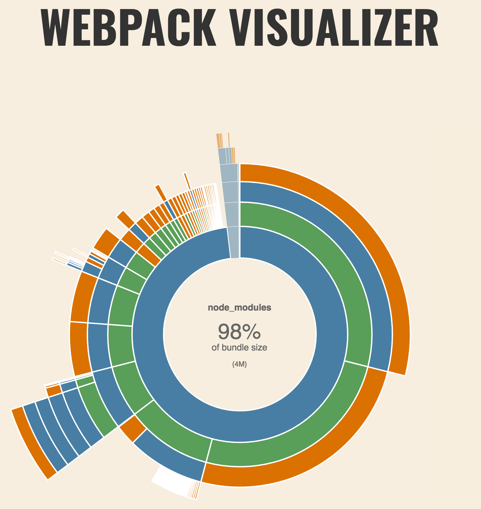

# AngularJS Common Module

[](https://travis-ci.org/holisticon/angularjs-common)
[](https://badge.fury.io/js/%40holisticon%2Fangularjs-common)
[](https://codeclimate.com/github/holisticon/angularjs-common) 
[](https://codeclimate.com/github/holisticon/angularjs-common) 
[](https://david-dm.org/holisticon/angularjs-common) 
[](https://david-dm.org/holisticon/angularjs-common#info=devDependencies)

> A simple module for AngularJS , that encapsulates the complete Webpack build and just requires some basic configuration in the using AngularJS projects without hassle around with the build

[](https://nodei.co/npm/@holisticon/angularjs-common/)

## Installation

```
npm install @holisticon/angularjs-common --save
```

Or if you want to use the development version (nightly build), which maybe **not stable**:

```
npm install @holisticon/angularjs-common@next --save
```

## Usage

### Basic Usage

* Create an config path, e.g. etc/appConfig.js:
```javascript
var path = require("path");
// resolve paths
var sourceRoot = path.resolve(__dirname, '..', 'src', 'main', 'frontend'),
  testRoot = path.resolve(__dirname, '..', 'src', 'test', 'frontend'),
  distRoot = path.resolve(__dirname, '..', 'src', 'main', 'resources', 'static');
// overwrite defaults
var appConfig = {
  srcPath: 'src/main/frontend',
  testPath: 'src/test/frontend',
  entry: {
    app: sourceRoot + '/scripts/app.js',
    salesboard: sourceRoot + '/scripts/app.salesboard.js',
    assignment: sourceRoot + '/scripts/app.assignment.js'
  },
  srcApp: path.resolve(sourceRoot, 'app'),
  testApp: path.resolve(testRoot, 'specs'),
  srcSASS: path.resolve(sourceRoot, 'scss'),
  srcI18N: path.resolve(sourceRoot, 'app', 'i18n'),
  srcIMG: path.resolve(sourceRoot, 'img'),
  dist: distRoot
};
module.exports = appConfig;

```
And provide a dummy files for
* karma.conf.js:
```javascript
process.env['APP_CONFIG'] = require("path").resolve(__dirname, 'etc', 'appConfig.js');
module.exports = require('@holisticon/angularjs-common').karma;
```
* karma.conf.ci.js:
```javascript
process.env['APP_CONFIG'] = require("path").resolve(__dirname, 'etc', 'appConfig.js');
module.exports = require('@holisticon/angularjs-common').karma_ci;
```
* webpack.config.js:
```javascript
process.env['APP_CONFIG'] = require("path").resolve(__dirname, 'etc', 'appConfig.js');
module.exports = require('@holisticon/angularjs-common').webpack;
```
* Append following entries to your package.json:
```javascript
  ...
  "scripts": {
    "start": "npm install && npm run watch",
    "watch": "cross-env NODE_ENV=development webpack-dev-server --hot --inline --colors --progress --display-error-details --port 3000 ",
    "build": "cross-env NODE_ENV=production webpack",
    "test": "cross-env NODE_ENV=test karma start etc/karma.conf.ci.js",
    "debug": "cross-env NODE_ENV=test karma start etc/karma.conf.js"
  },
  ...
```

If you run `npm run watch` you can see your dependency statistics at [localhost:3000/statistics.html](http://localhost:3000/statistics.html):


### Advanced Usage

#### JUnit-Report customization

```javascript
...
var appConfig = {
  ...
    junit: {
    title: 'MyProject',
    dir: 'dist/test-reports'
  },
  ...
};

module.exports = appConfig;

```

#### Multiple apps

```
var path = require("path");

// resolve paths
var sourceRoot = path.resolve(__dirname, '..', 'src', 'main', 'frontend'),
  testRoot = path.resolve(__dirname, '..', 'src', 'test', 'frontend'),
  distRoot = path.resolve(__dirname, '..', 'src', 'main', 'resources', 'static');
// overwrite defaults
var appConfig = {
  srcPath: 'src/main/frontend',
  testPath: 'src/test/frontend',
  testSpecs: '/specs/**/*.ts',
  templatesPath: 'src/main/frontend/scripts/templates',
  entry: {
    app: sourceRoot + '/scripts/app.js',
    salesboard: sourceRoot + '/scripts/app.salesboard.js',
    assignment: sourceRoot + '/scripts/app.assignment.js'
  },
  index: 'src/main/frontend/index.html',
  srcApp: path.resolve(sourceRoot, 'app'),
  testApp: path.resolve(testRoot, 'specs'),
  srcSASS: path.resolve(sourceRoot, 'scss'),
  srcI18N: path.resolve(sourceRoot, 'app', 'i18n'),
  srcIMG: path.resolve(sourceRoot, 'img'),
  dist: distRoot,
  proxy: {
    '*': 'http://localhost:8080' // REST service
  }
};
module.exports = appConfig;var path = require("path");

// resolve paths
var sourceRoot = path.resolve(__dirname, '..', 'src', 'main', 'frontend'),
  testRoot = path.resolve(__dirname, '..', 'src', 'test', 'frontend'),
  distRoot = path.resolve(__dirname, '..', 'src', 'main', 'resources', 'static');
// overwrite defaults
var appConfig = {
  srcPath: 'src/main/frontend',
  testPath: 'src/test/frontend',
  appPath: 'src/main/frontend/scripts/app*.js',
  templatesPath: 'src/main/frontend/scripts/templates',
  entry: {
    app: sourceRoot + '/scripts/app.js',
    salesboard: sourceRoot + '/scripts/app.salesboard.js',
    assignment: sourceRoot + '/scripts/app.assignment.js'
  },
  chunks: {
    filename: "commons.[chunkhash].chunk.js",
    name: "commons"
  },
  indexFiles: [{
    filename: 'index.html',
    template: 'src/main/frontend/index.html',
    chunks: ['app', 'commons'],
    chunksSortMode: 'dependency'
  }, {
    filename: 'salesboard.html',
    template: 'src/main/frontend/salesboard.html',
    chunks: ['salesboard', 'commons'],
    chunksSortMode: 'dependency'
  }, {
    filename: 'assignment.html',
    template: 'src/main/frontend/assignment.html',
    chunks: ['assignment', 'commons'],
    chunksSortMode: 'dependency'
  }],
  srcApp: path.resolve(sourceRoot, 'app'),
  testApp: path.resolve(testRoot, 'specs'),
  srcSASS: path.resolve(sourceRoot, 'scss'),
  srcI18N: path.resolve(sourceRoot, 'app', 'i18n'),
  srcIMG: path.resolve(sourceRoot, 'img'),
  dist: distRoot,
  proxy: {
    '*': 'http://localhost:8080' // REST service
  },
  additionalWebpackOptions: {
    plugins {
      /* show only de and en locale */
      new webpack.NormalModuleReplacementPlugin(
        /moment[\/\\]locale$/,
        /de|en/
      )
    }
  }
};
module.exports = appConfig;

```
